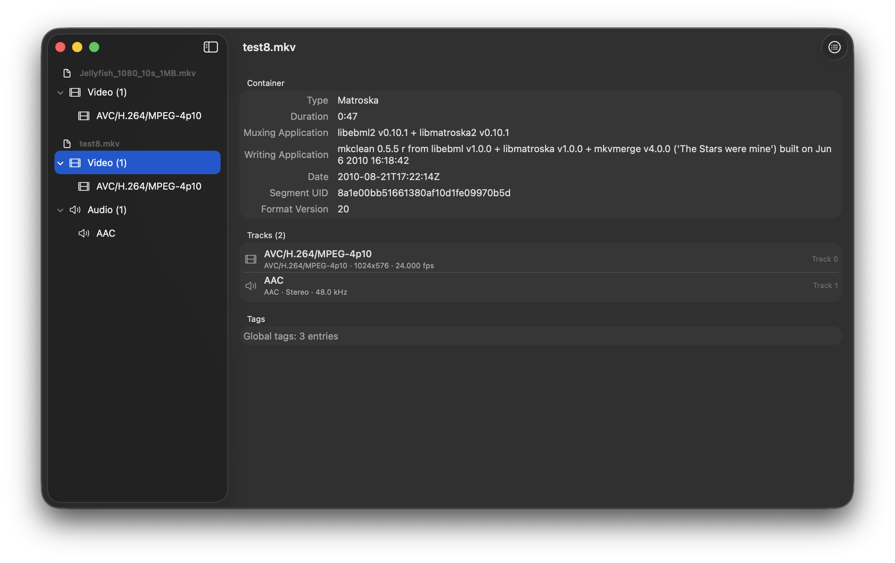

# Babushka


A macOS app for inspecting and editing MKV (Matroska) files. Babushka provides a clean, native interface for viewing file metadata, track information, and container properties — and for non-destructively editing track flags, properties, and structure using mkvtoolnix under the hood.



*Example files from [matroska-test-files](https://github.com/ietf-wg-cellar/matroska-test-files/)*

## Features

- **File Inspection** — Browse MKV file structure with a sidebar-driven interface
  - Container properties (duration, muxing application, dates, segment UID)
  - Video tracks (codec, pixel/display dimensions, frame rate, stereo mode)
  - Audio tracks (codec, channels, sampling frequency, bits per sample)
  - Subtitle tracks (codec, encoding, language)
  - Attachments with image preview support
  - Dynamic tag property display
- **Track Editing** — Non-destructive editing with undo/redo
  - Edit track flags (default, forced, enabled, original, visual impaired, commentary)
  - Edit track name and language
  - Pixel crop editing with aspect ratio presets (16:9, 4:3, 2.39:1, 1:1)
  - Remove and reorder tracks
  - Add external tracks from files
- **Export** — Extract tracks and attachments
  - Export individual tracks with auto-detected file extensions
  - Export embedded attachments
- **Output Modes** — Three strategies when applying changes
  - Backup original file
  - Overwrite in place (via mkvpropedit for property-only changes)
  - Choose a custom output location
- **Background Jobs** — Queue and monitor export and modification operations

## Requirements

- macOS 15.0 or later
- [mkvtoolnix](https://mkvtoolnix.download/) installed (`brew install mkvtoolnix`)

## Getting Started

1. Install mkvtoolnix:
   ```bash
   brew install mkvtoolnix
   ```

2. Open `Babushka.xcodeproj` in Xcode

3. Build and run (Cmd+R)

4. Open an MKV file via Cmd+O or the welcome screen button

## Building from Command Line

```bash
# Build
xcodebuild -project Babushka.xcodeproj -scheme Babushka build

# Run tests
xcodebuild -project Babushka.xcodeproj -scheme Babushka test
```

## Architecture

Babushka follows MVVM with a service layer:

- **Models** — Codable structs mapping mkvmerge JSON output, with nested grouping for flags, video, and audio properties
- **Services** — Actor-based mkvmerge/mkvpropedit/mkvextract process execution
- **ViewModels** — Observable state management for app, per-file state, and background jobs
- **Views** — SwiftUI views with NavigationSplitView layout

See [docs/ARCHITECTURE.md](docs/ARCHITECTURE.md) for details.

## License

MIT License - Copyright (c) Alleato L.L.C
